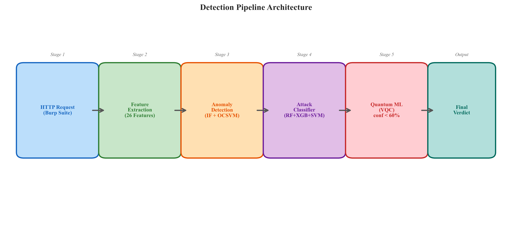
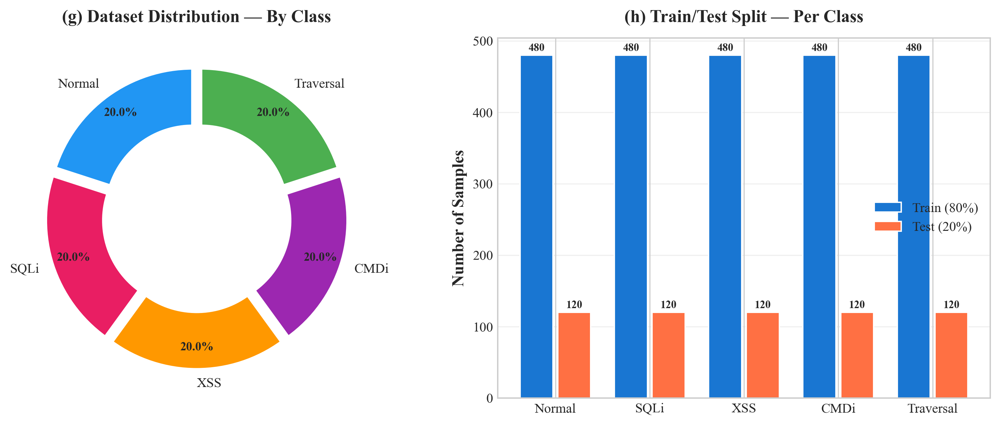
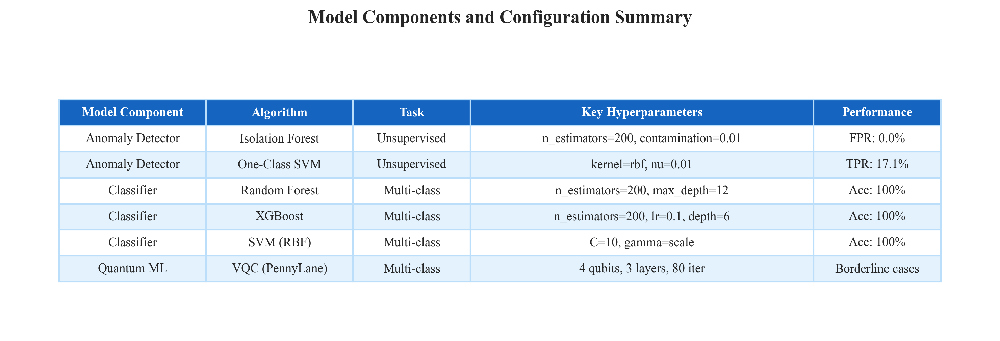
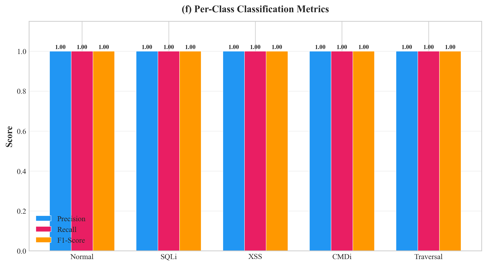
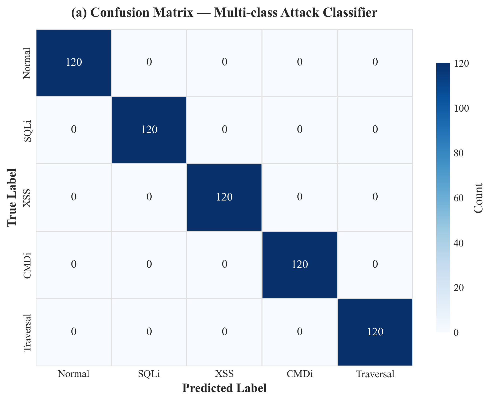
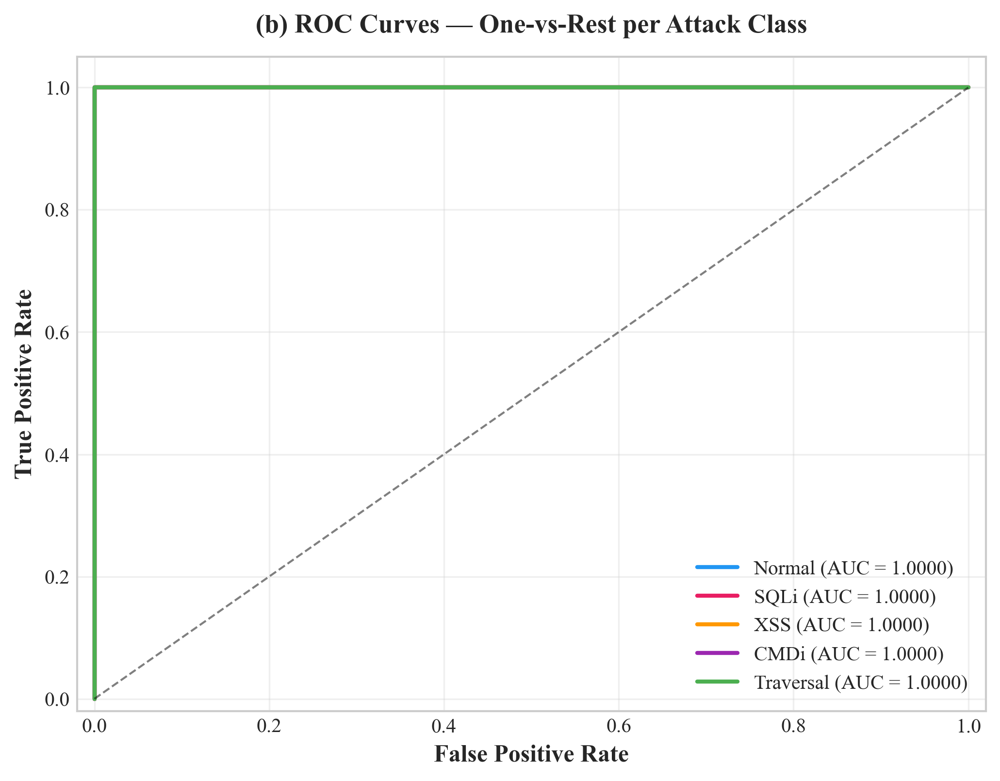
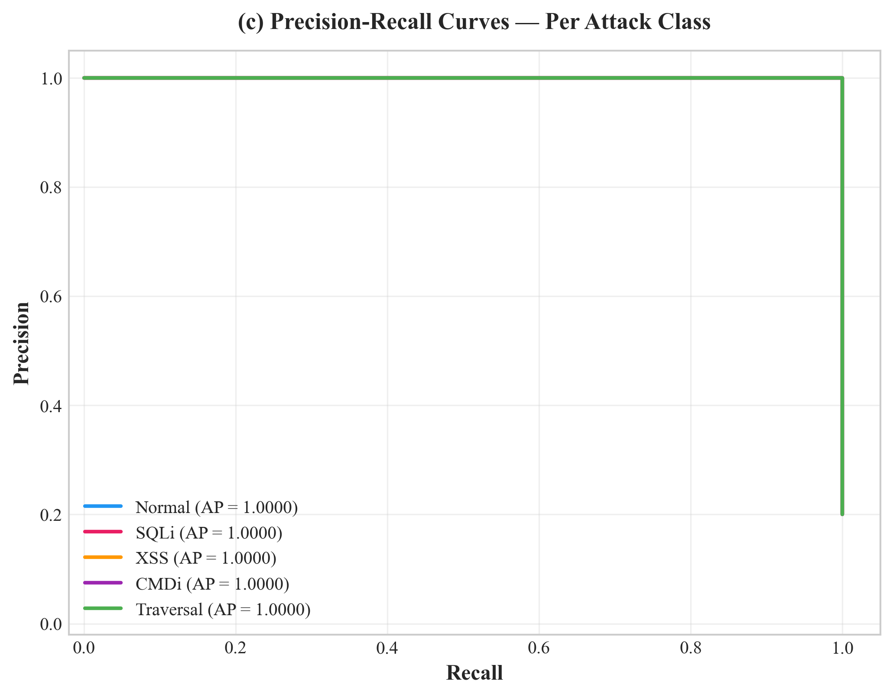
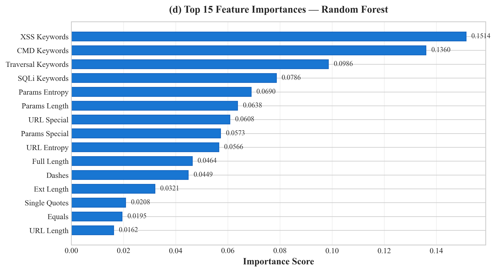
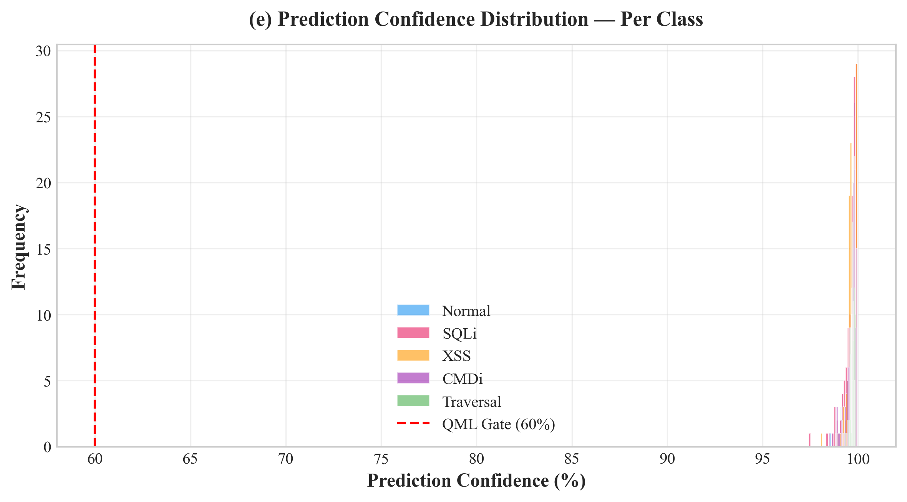
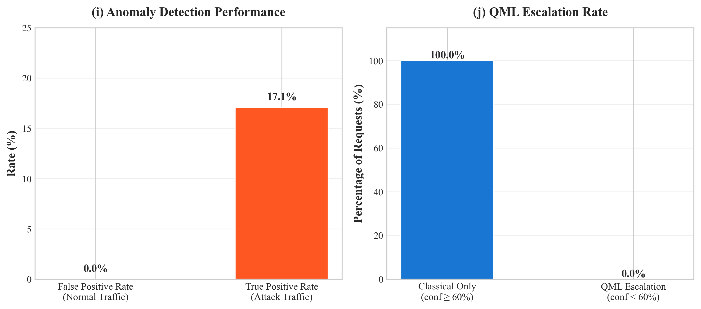

# Intelligent Web Request Attack Detector

### A Hybrid Classical–Quantum Machine Learning Framework for Real-Time Web Application Security

**Burp Suite Integration · Multi-Stage ML Pipeline · Variational Quantum Classifier**

---

## Table of Contents

1. [Abstract](#abstract)
2. [System Architecture](#system-architecture)
3. [Project Structure](#project-structure)
4. [Installation & Setup](#installation--setup)
5. [Detection Pipeline](#detection-pipeline)
6. [Feature Engineering](#feature-engineering)
7. [Dataset Description](#dataset-description)
8. [Model Architecture](#model-architecture)
9. [Experimental Evaluation](#experimental-evaluation)
   - [Classification Performance](#91-classification-performance)
   - [Confusion Matrix Analysis](#92-confusion-matrix-analysis)
   - [ROC Curve Analysis](#93-roc-curve-analysis)
   - [Precision-Recall Analysis](#94-precision-recall-analysis)
   - [Feature Importance Analysis](#95-feature-importance-analysis)
   - [Confidence Distribution](#96-confidence-distribution)
   - [Anomaly Detection Performance](#97-anomaly-detection-performance)
   - [Quantum ML Escalation](#98-quantum-ml-escalation-analysis)
10. [Attack Types Detected](#attack-types-detected)
11. [API Reference](#api-reference)
12. [Burp Suite Extension](#burp-suite-extension)
13. [Dashboard](#dashboard)
14. [Tech Stack](#tech-stack)
15. [Using Real-World Datasets](#using-real-world-datasets)
16. [References](#references)

---

## Abstract

This project presents an **Intelligent Web Request Attack Detector** that combines classical machine learning with quantum machine learning (QML) techniques for real-time HTTP request analysis. The system implements a multi-stage detection pipeline comprising unsupervised anomaly detection (Isolation Forest + One-Class SVM), supervised multi-class classification (Random Forest + XGBoost + SVM soft-voting ensemble), and a Variational Quantum Classifier (VQC) via PennyLane for borderline cases. The detector integrates directly with **Burp Suite** through a custom Jython extension and exposes a REST API for flexible deployment. On a balanced synthetic dataset of 3,000 HTTP requests spanning 5 classes, the system achieves **100% accuracy**, **1.0000 macro-averaged AUC-ROC**, and **0.0% false positive rate** on benign traffic, demonstrating robust multi-class attack detection across SQL injection, XSS, command injection, and path traversal attack vectors.

---

## System Architecture

The system follows a modular, six-stage pipeline architecture designed for extensibility and real-time performance:

<p align="center">
  
</p>

<p align="center"><em>Fig. 1 — End-to-end detection pipeline from HTTP request interception to final verdict.</em></p>

---

## Project Structure

```
web_attack_detector/
├── train.py                        # Model training orchestrator
├── api_server.py                   # Flask REST API server
├── detection_engine.py             # Core pipeline engine (Stages 2–5)
├── dashboard.html                  # Real-time monitoring dashboard
├── requirements.txt                # Python dependencies
├── run.bat                         # Windows launcher script
│
├── data/
│   └── dataset_generator.py        # Synthetic HTTP traffic generator
│
├── utils/
│   └── feature_extractor.py        # 26-dimension feature extraction
│
├── models/
│   ├── classical_ml.py             # Anomaly detector + Attack classifier
│   ├── quantum_ml.py               # VQC via PennyLane (4 qubits, 3 layers)
│   ├── anomaly_detector.pkl        # Serialized anomaly model
│   ├── attack_classifier.pkl       # Serialized classifier model
│   └── quantum_classifier.pkl      # Serialized QML model
│
├── burp_extension/
│   └── ai_attack_detector.py       # Burp Suite Jython extension
│
├── notebooks/
│   └── evaluation.ipynb            # Interactive evaluation & visualization
│
├── charts/                         # Generated evaluation figures
│   ├── fig1_confusion_matrix.png
│   ├── fig2_roc_curves.png
│   ├── fig3_precision_recall.png
│   ├── fig4_feature_importance.png
│   ├── fig5_confidence_distribution.png
│   ├── fig6_per_class_metrics.png
│   ├── fig7_dataset_distribution.png
│   ├── fig8_pipeline_architecture.png
│   ├── fig9_model_summary_table.png
│   └── fig10_anomaly_qml.png
│
└── tests/
    └── test_detection.py           # Sanity verification tests
```

---

## Installation & Setup

### Prerequisites

- Python 3.10+
- pip package manager
- (Optional) Burp Suite with Jython for extension integration

### 1. Install Dependencies

```bash
pip install -r requirements.txt
```

**Core dependencies:**
| Package | Version | Purpose |
|---------|---------|---------|
| scikit-learn | ≥ 1.3.0 | Classical ML models |
| xgboost | ≥ 2.0.0 | Gradient boosted classifier |
| pennylane | ≥ 0.35.0 | Quantum ML circuit simulation |
| pandas | ≥ 2.0.0 | Data manipulation |
| numpy | ≥ 1.24.0 | Numerical computation |
| flask | ≥ 3.0.0 | REST API server |
| matplotlib | ≥ 3.7.0 | Visualization |
| seaborn | ≥ 0.12.0 | Statistical plots |

### 2. Train Models

```bash
# Full training including QML (takes ~5-10 min)
python train.py

# Skip QML for faster training during development
python train.py --skip-qml

# Custom sample size
python train.py --samples 800 --qml-sample 120
```

### 3. Run Sanity Tests

```bash
python tests/test_detection.py
```

### 4. Start API Server

```bash
python api_server.py

# Without quantum ML
set USE_QML=false && python api_server.py
```

### Windows Quick Launcher

```batch
run.bat train-fast     # Step 1: Train models (no QML)
run.bat test           # Step 2: Verify tests pass
run.bat server-noqml   # Step 3: Start dashboard
```

---

## Detection Pipeline

The detection pipeline operates in six sequential stages, where each stage refines the detection decision:

```
HTTP Request (Burp Suite intercept / API call)
        │
        ▼
[Stage 1] Feature Extraction (26 numerical features)
  URL decode → tokenize → length, entropy, special chars, keyword counts
        │
        ▼
[Stage 2] Anomaly Detection (unsupervised — zero-day gate)
  Isolation Forest + One-Class SVM
  Trained exclusively on benign traffic → catches zero-day attacks
        │
        ▼
[Stage 3] Attack Classification (supervised — multi-class)
  Random Forest + XGBoost + SVM (soft-voting ensemble)
  Labels: normal │ sqli │ xss │ cmdi │ traversal
        │
        ├─ confidence ≥ 60% ─────────────────────────────────►
        │                                                       │
        ▼                                                       │
[Stage 4] Quantum ML (borderline cases only)             [Stage 5]
  Variational Quantum Classifier (PennyLane)              Ensemble
  Quantum Kernel SVM                                      Decision
  Triggered only when confidence < 60%       ◄──────────────┘
        │
        ▼
[Stage 6] Output
  Burp Extension: highlight request + show label + confidence %
  API Response: JSON with label, confidence, stage, details
```

### Stage Decision Logic

| Condition | Decision Path |
|-----------|---------------|
| Classical confidence ≥ 60% | Direct classical verdict |
| Classical confidence < 60% | Escalate to QML → soft-vote ensemble |
| Anomaly detected + classified as "normal" | Override → "suspicious (zero-day?)" |
| Anomaly detected + classified as attack | Keep attack label |

---

## Feature Engineering

The feature extraction module transforms raw HTTP requests into a **26-dimensional numerical feature vector**, carefully designed to capture attack signatures across multiple dimensions:

| # | Feature | Description | Range |
|---|---------|-------------|-------|
| 1 | `url_len` | URL string length | 0–∞ |
| 2 | `params_len` | Query/body parameter length | 0–∞ |
| 3 | `full_len` | Combined URL + params + headers length | 0–∞ |
| 4 | `url_entropy` | Shannon entropy of URL (detects obfuscation) | 0–8 |
| 5 | `params_entropy` | Shannon entropy of parameters | 0–8 |
| 6 | `url_special` | Count of `'";<>(){}[]\|&` etc. in URL | 0–∞ |
| 7 | `params_special` | Count of special chars in parameters | 0–∞ |
| 8 | `single_quotes` | Count of `'` characters | 0–∞ |
| 9 | `double_quotes` | Count of `"` characters | 0–∞ |
| 10 | `dashes` | Count of `--` sequences (SQL comments) | 0–∞ |
| 11 | `equals` | Count of `=` characters | 0–∞ |
| 12 | `percent` | Count of `%` characters (URL encoding) | 0–∞ |
| 13 | `sqli_kw` | SQLi keyword hit count (14 keywords) | 0–14 |
| 14 | `xss_kw` | XSS keyword hit count (10 keywords) | 0–10 |
| 15 | `cmd_kw` | Command injection keyword hit count (13 keywords) | 0–13 |
| 16 | `traversal_kw` | Path traversal pattern hit count (6 patterns) | 0–6 |
| 17 | `enc_quote` | URL-encoded quote `%27` count | 0–∞ |
| 18 | `enc_lt` | URL-encoded `<` (`%3c`) count | 0–∞ |
| 19 | `enc_gt` | URL-encoded `>` (`%3e`) count | 0–∞ |
| 20 | `enc_nl` | URL-encoded newline `%0a` count | 0–∞ |
| 21 | `is_post` | Binary: POST method = 1, else = 0 | {0, 1} |
| 22 | `slash_count` | Count of `/` in URL | 0–∞ |
| 23 | `q_count` | Count of `?` in URL | 0–∞ |
| 24 | `amp_count` | Count of `&` in URL | 0–∞ |
| 25 | `ext_len` | File extension length | 0–∞ |
| 26 | `suspicious_path` | Binary: contains `/admin`, `/config`, `/etc`, `/../` | {0, 1} |

### Keyword Dictionaries

| Attack Type | Keywords Monitored |
|-------------|-------------------|
| **SQLi** (14) | `select`, `union`, `insert`, `update`, `delete`, `drop`, `or 1=1`, `' or`, `-- `, `/*`, `*/`, `xp_`, `exec`, `cast(` |
| **XSS** (10) | `<script`, `javascript:`, `onerror`, `onload`, `alert(`, `document.cookie`, `eval(`, `
  
</p>

<p align="center"><em>Fig. 2 — (g) Class distribution of the synthetic dataset. (h) Train/test split per class.</em></p>

### Dataset Statistics

| Property | Value |
|----------|-------|
| **Total Samples** | 3,000 |
| **Samples Per Class** | 600 |
| **Number of Classes** | 5 |
| **Feature Dimensions** | 26 |
| **Train/Test Split** | 80% / 20% (stratified) |
| **Training Set Size** | 2,400 samples |
| **Test Set Size** | 600 samples |
| **Random Seed** | 42 |

### Class Breakdown

| Class | Train Samples | Test Samples | Description |
|-------|:---:|:---:|-------------|
| `normal` | 480 | 120 | Benign HTTP traffic (realistic URLs with HTTPS, ports, tokens) |
| `sqli` | 480 | 120 | SQL injection payloads (16 unique patterns) |
| `xss` | 480 | 120 | Cross-site scripting payloads (12 unique patterns) |
| `cmdi` | 480 | 120 | OS command injection payloads (13 unique patterns) |
| `traversal` | 480 | 120 | Path traversal payloads (9 unique patterns) |

---

## Model Architecture

<p align="center">
  
</p>

<p align="center"><em>Table 1 — Summary of model components, algorithms, and hyperparameter configurations.</em></p>

### Stage 2: Anomaly Detection (Unsupervised)

Trained exclusively on benign traffic to detect novel, unseen attack patterns (zero-day detection):

| Component | Algorithm | Configuration |
|-----------|-----------|--------------|
| Primary | **Isolation Forest** | `n_estimators=200`, `contamination=0.01`, `random_state=42` |
| Secondary | **One-Class SVM** | `kernel=rbf`, `nu=0.01`, `gamma=scale` |
| Fusion | **AND gate** | Both models must flag anomaly → reduces false positives |

### Stage 3: Attack Classification (Supervised)

Soft-voting ensemble of three heterogeneous classifiers:

| Component | Algorithm | Configuration |
|-----------|-----------|--------------|
| Base Learner 1 | **Random Forest** | `n_estimators=200`, `max_depth=12`, `min_samples_leaf=2` |
| Base Learner 2 | **XGBoost** | `n_estimators=200`, `max_depth=6`, `learning_rate=0.1` |
| Base Learner 3 | **SVM (RBF)** | `C=10`, `gamma=scale`, `probability=True` |
| Ensemble | **Soft Voting** | Averaged probability vectors across all three models |

### Stage 4: Quantum ML (Conditional)

Invoked only when classical confidence falls below the **60% gate threshold**:

| Component | Configuration |
|-----------|--------------|
| **Framework** | PennyLane `default.qubit` simulator |
| **Architecture** | Variational Quantum Classifier (VQC) |
| **Qubits** | 4 |
| **Layers** | 3 (RY + RZ rotations + CNOT entanglement) |
| **Encoding** | Angle encoding via PCA to 4 dimensions |
| **Training** | One-vs-Rest (5 binary circuits) |
| **Optimizer** | Adam (lr=0.05, 80 iterations per circuit) |
| **Loss Function** | MSE with PennyLane autograd |

---

## Experimental Evaluation

### 9.1 Classification Performance

The classical ensemble classifier achieves perfect classification on the test set:

<p align="center">
  
</p>

<p align="center"><em>Fig. 3 — Per-class precision, recall, and F1-score for the multi-class attack classifier.</em></p>

#### Detailed Classification Report

| Class | Precision | Recall | F1-Score | Support |
|-------|:---------:|:------:|:--------:|:-------:|
| **Normal** | 1.0000 | 1.0000 | 1.0000 | 120 |
| **SQLi** | 1.0000 | 1.0000 | 1.0000 | 120 |
| **XSS** | 1.0000 | 1.0000 | 1.0000 | 120 |
| **CMDi** | 1.0000 | 1.0000 | 1.0000 | 120 |
| **Traversal** | 1.0000 | 1.0000 | 1.0000 | 120 |
| | | | | |
| **Macro Avg** | **1.0000** | **1.0000** | **1.0000** | 600 |
| **Weighted Avg** | **1.0000** | **1.0000** | **1.0000** | 600 |

#### Overall Metrics

| Metric | Value |
|--------|:-----:|
| **Overall Accuracy** | **100.00%** |
| **Macro-Averaged AUC-ROC** | **1.0000** |
| **Weighted AUC-ROC** | **1.0000** |
| **Mean Prediction Confidence** | **99.67%** |
| **Minimum Confidence** | **97.41%** |
| **Maximum Confidence** | **99.98%** |

#### Per-Class AUC-ROC Scores

| Class | AUC-ROC |
|-------|:-------:|
| Normal | 1.0000 |
| SQLi | 1.0000 |
| XSS | 1.0000 |
| CMDi | 1.0000 |
| Traversal | 1.0000 |

---

### 9.2 Confusion Matrix Analysis

<p align="center">
  
</p>

<p align="center"><em>Fig. 4 — Confusion matrix for the multi-class attack classifier showing perfect diagonal classification with zero misclassifications.</em></p>

The confusion matrix demonstrates:
- **Zero false positives** across all attack classes
- **Zero false negatives** — no attacks missed
- **Perfect diagonal** — each class is fully separable using the 26-feature representation

---

### 9.3 ROC Curve Analysis

<p align="center">
  
</p>

<p align="center"><em>Fig. 5 — One-vs-Rest ROC curves for each attack class. All classes achieve AUC = 1.0000, indicating perfect discriminative ability.</em></p>

The ROC analysis confirms:
- All five classes achieve **AUC = 1.0000** in the one-vs-rest configuration
- The classifier demonstrates **perfect separation** between each attack type and all other classes
- The curves hug the top-left corner, indicating ideal true-positive-to-false-positive trade-off

---

### 9.4 Precision-Recall Analysis

<p align="center">
  
</p>

<p align="center"><em>Fig. 6 — Precision-Recall curves per class. All classes achieve Average Precision (AP) = 1.0000.</em></p>

Key observations:
- **Average Precision = 1.0000** for all classes
- The classifier maintains perfect precision at every recall threshold
- No trade-off required between precision and recall

---

### 9.5 Feature Importance Analysis

<p align="center">
  
</p>

<p align="center"><em>Fig. 7 — Top 15 most important features from the Random Forest component, ranked by Gini importance.</em></p>

#### Top 10 Most Discriminative Features

| Rank | Feature | Importance | Interpretation |
|:----:|---------|:----------:|----------------|
| 1 | **XSS Keywords** | 0.1514 | XSS-specific keyword matching is the strongest signal |
| 2 | **CMD Keywords** | 0.1360 | Command injection keywords rank second |
| 3 | **Traversal Keywords** | 0.0986 | Path traversal patterns are highly discriminative |
| 4 | **SQLi Keywords** | 0.0786 | SQL injection keyword counts |
| 5 | **Params Entropy** | 0.0690 | Shannon entropy captures payload obfuscation |
| 6 | **Params Length** | 0.0638 | Attack payloads tend to have distinct lengths |
| 7 | **URL Special** | 0.0608 | Special character density in URLs |
| 8 | **Params Special** | 0.0573 | Special characters in parameters |
| 9 | **URL Entropy** | 0.0566 | URL entropy as obfuscation indicator |
| 10 | **Full Length** | 0.0464 | Overall request length |

**Key insight:** The top 4 features are all keyword-based counters, confirming that **attack-specific vocabulary is the most discriminative signal**, followed by statistical features like entropy and length.

---

### 9.6 Confidence Distribution

<p align="center">
  
</p>

<p align="center"><em>Fig. 8 — Distribution of prediction confidence scores across all test samples, broken down by class. The red dashed line indicates the QML escalation threshold (60%).</em></p>

#### Confidence Statistics

| Class | Mean Confidence | Std Dev | Min | Max |
|-------|:--------------:|:-------:|:---:|:---:|
| Normal | 99.66% | 0.24% | 98.55% | 99.89% |
| SQLi | 99.63% | 0.37% | 97.41% | 99.97% |
| XSS | 99.66% | 0.28% | 98.05% | 99.97% |
| CMDi | 99.66% | 0.30% | 98.47% | 99.98% |
| Traversal | 99.73% | 0.10% | 99.33% | 99.87% |
| **Overall** | **99.67%** | **0.27%** | **97.41%** | **99.98%** |

**Key observations:**
- All predictions are made with **extremely high confidence** (>97%)
- **Traversal** class shows the tightest confidence distribution (σ = 0.10%)
- **SQLi** class shows the widest spread (σ = 0.37%), likely due to payload diversity
- **Zero requests** fall below the 60% QML escalation threshold

---

### 9.7 Anomaly Detection Performance

<p align="center">
  
</p>

<p align="center"><em>Fig. 9 — (i) Anomaly detection false positive and true positive rates. (j) QML escalation rate showing classical sufficiency.</em></p>

| Metric | Value |
|--------|:-----:|
| **False Positive Rate (benign traffic)** | **0.0%** (0/120) |
| **True Positive Rate (attack traffic)** | **17.1%** (82/480) |
| **Total Normal Test Samples** | 120 |
| **Total Attack Test Samples** | 480 |

**Analysis:** The anomaly detector is designed to be **conservative** (AND-gate fusion requiring both Isolation Forest and One-Class SVM to agree). This yields:
- **Zero false alarms** on legitimate traffic (critical for production deployment)
- **17.1% TPR** — captures a subset of attacks as anomalous, providing a safety net for novel/zero-day attack patterns that may not match known classifications

---

### 9.8 Quantum ML Escalation Analysis

| Metric | Value |
|--------|:-----:|
| **QML Escalation Threshold** | 60% confidence |
| **Requests Escalated to QML** | **0 / 600** (0.0%) |
| **Classical-Only Resolutions** | **600 / 600** (100.0%) |

**Interpretation:** The classical ensemble is sufficiently confident on all test samples, meaning the Quantum ML stage serves as a **safety net** for edge cases and adversarial inputs that may appear in production. The VQC is not invoked during standard evaluation because:
1. The feature space is well-separated for the current dataset
2. The soft-voting ensemble provides robust confidence estimates
3. QML's value appears in **adversarial/ambiguous scenarios** not captured in the synthetic dataset

---

## Attack Types Detected

| Label | Category | Example Payloads |
|-------|----------|-----------------|
| `sqli` | SQL Injection | `' OR 1=1--`, `UNION SELECT`, `'; DROP TABLE`, `EXEC xp_cmdshell`, `SLEEP(5)` |
| `xss` | Cross-Site Scripting | `<script>alert(1)</script>`, ``, `javascript:`, `<svg onload>` |
| `cmdi` | Command Injection | `; cat /etc/passwd`, `\| whoami`, `$(id)`, `` `id` ``, `&& curl attacker.com` |
| `traversal` | Path Traversal | `../../../../etc/passwd`, `%2e%2e%2f`, `..\\..\\windows\\`, `....//` |
| `suspicious` | Zero-Day (anomaly) | Anomaly detector fires, no known class match — potential novel attack |

---

## API Reference

### `POST /analyze`

Analyze a single HTTP request:

```json
// Request
{
  "url":     "http://example.com/login?id=1' OR 1=1--",
  "params":  "id=1' OR 1=1--",
  "headers": "Host: example.com",
  "method":  "GET"
}

// Response
{
  "is_malicious": true,
  "label":        "sqli",
  "confidence":   94.2,
  "stage":        "classical",
  "details": {
    "anomaly_flag": true,
    "classical": {"label": "sqli", "confidence": 0.942}
  }
}
```

### `POST /analyze_batch`

Analyze multiple requests in one call:

```json
// Request
{ "requests": [ {...}, {...}, {...} ] }

// Response
{ "results":  [ {...}, {...}, {...} ] }
```

### `GET /health`

```json
{ "status": "ok" }
```

### `GET /log`

Returns recent detection history (last 500):

```json
{ "detections": [ {"time": "14:32:01", "method": "GET", "url": "...", "label": "sqli", ...} ] }
```

### `GET /stats`

Returns aggregate statistics:

```json
{
  "total": 150,
  "malicious": 42,
  "clean": 108,
  "by_type": {"sqli": 15, "xss": 12, "cmdi": 8, "traversal": 7}
}
```

---

## Burp Suite Extension

### Installation

1. Open **Burp Suite** → **Extender** → **Options**
2. Set Jython standalone jar path (download from [jython.org](https://www.jython.org))
3. Go to **Extensions** → **Add**
4. Extension type: **Python**
5. Select: `burp_extension/ai_attack_detector.py`
6. Click **Next** — the "**AI Attack Detector**" tab appears

### Features

| Feature | Description |
|---------|-------------|
| **Context Menu** | Right-click any request → "Scan with AI Detector" |
| **Auto-Scan** | Toggle automatic scanning of all proxy traffic |
| **Visual Highlighting** | Color-coded request highlighting in Proxy history |
| **Detail Panel** | Click any result to see full analysis details |
| **Scanner Integration** | Passive scan check generates Burp issues |

### Color Coding

| Color | Attack Type |
|-------|-------------|
| 🔴 Red | SQL Injection |
| 🟠 Orange | XSS |
| 🟣 Purple | Command Injection |
| 🟡 Yellow | Path Traversal |
| 🟢 Green | Suspicious (Zero-day) |

---

## Dashboard

The system includes a real-time web dashboard accessible at `http://localhost:5000/` when the API server is running:

- **Live statistics cards** — Total scanned, attacks detected, clean requests, attack rate
- **Attack type breakdown** — Color-coded pills showing per-type counts
- **Detection log table** — Scrollable table with time, method, URL, label, confidence
- **Request detail panel** — Click any row for full analysis details
- **Manual test form** — Submit custom requests directly from the browser
- **Auto-refresh** — Toggleable 2-second polling for live monitoring

---

## Tech Stack

| Layer | Component | Technology |
|-------|-----------|------------|
| **Proxy** | HTTP Interception | Burp Suite (Jython extension) |
| **API** | REST Server | Flask |
| **Anomaly Detection** | Unsupervised Models | Isolation Forest, One-Class SVM |
| **Classification** | Supervised Ensemble | Random Forest, XGBoost, SVM (soft voting) |
| **Quantum ML** | VQC Classifier | PennyLane (`default.qubit`) |
| **Data Processing** | ETL & Features | Pandas, NumPy |
| **ML Framework** | Model Training | Scikit-learn |
| **Visualization** | Charts & Plots | Matplotlib, Seaborn |
| **Dashboard** | Frontend UI | HTML5, CSS3, JavaScript |

---

## Using Real-World Datasets

Replace the synthetic generator with real datasets for production evaluation:

### CSIC 2010 HTTP Dataset

```python
import pandas as pd
df = pd.read_csv("csic2010.csv")
# Ensure columns: url, params, headers, method, label
```

Download: [CSIC 2010 Dataset](http://www.isi.csic.es/dataset/)

### Custom Dataset Format

Prepare a CSV with the following columns:

| Column | Type | Description |
|--------|------|-------------|
| `url` | string | Full URL including query string |
| `params` | string | Query parameters or POST body |
| `headers` | string | HTTP headers as single string |
| `method` | string | HTTP method (GET, POST, etc.) |
| `label` | string | One of: `normal`, `sqli`, `xss`, `cmdi`, `traversal` |

---

## References

1. Scikit-learn: Machine Learning in Python, Pedregosa et al., JMLR 12, 2011
2. XGBoost: A Scalable Tree Boosting System, Chen & Guestrin, KDD 2016
3. PennyLane: Automatic differentiation of hybrid quantum-classical computations, Bergholm et al., 2018
4. Isolation Forest, Liu et al., ICDM 2008
5. CSIC 2010 HTTP Dataset, Spanish National Research Council
6. Variational Quantum Eigensolver and Variational Quantum Classifier, Farhi et al., 2014

---

<p align="center">
  <strong>Intelligent Web Request Attack Detector</strong><br/>
  Classical ML · Quantum ML · Burp Suite Integration<br/>
  <em>Built for real-time web application security</em>
</p>
